<h1 align="center">Hi 👋, I'm Debopam Gupta</h1>
<h3 align="center">A passionate developer and a student</h3>
<h4 align="center">https://dgdev.vercel.app</h4>

- 🌱 I’m currently juggling between **Java, JavaScript**, **Go** and a bit of **Python**

- 💬 Ask me about **JS or Web Stuff** ( most comfortable )

- 📫 How to reach me - **Discord most preferably maybe [w3dg#6710](https://discord.com/users/613575716201824266)**

- 📨 Also Reach me by **Email** - [w3dg@duck.com](mailto:w3dg@duck.com)

- ⚡ Fun fact **I think I am funny**

<h3 align="left">Connect with me: </h3>

<h3 align="left">Languages and Tools:</h3>

                

<!--  -->

